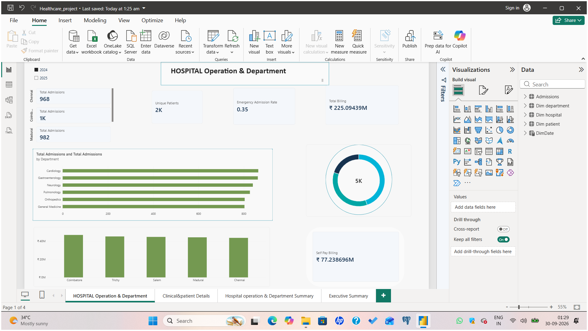
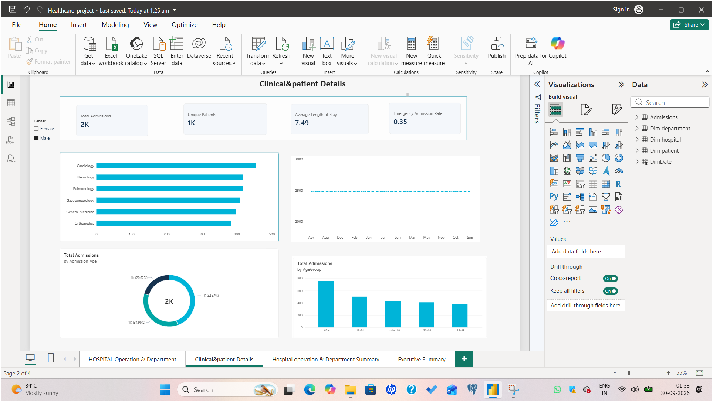
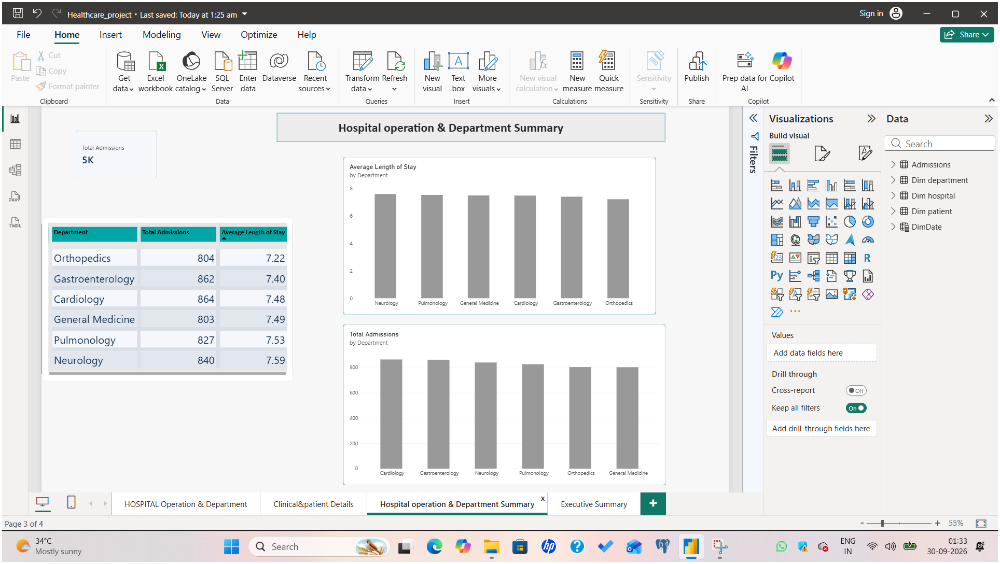
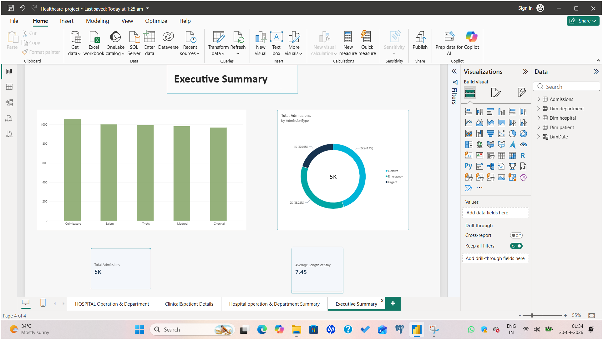

# Hospital Operations & Department Analysis | Power BI

A 4-page Power BI dashboard analysing hospital admissions, department performance, patient demographics and billing across 5 cities in Tamil Nadu (Chennai, Coimbatore, Madurai, Salem, Trichy).

## Tools Used
- Power BI Desktop
- DAX
- Data modelling (fact and dimension tables)

## Key KPIs
- Total Admissions
- Unique Patients
- Average Length of Stay
- Emergency Admission Rate
- Total Billing and Self Pay Billing

## Dashboard Pages

### 1. Hospital Operation & Department
City-wise admissions, department-wise admissions, total billing and self pay billing, with a year filter (2024 / 2025).

### 2. Clinical & Patient Details
Admissions by department, admission type and age group, monthly trend, with a gender filter.

### 3. Hospital Operation & Department Summary
Department-wise admissions and average length of stay.

### 4. Executive Summary
High-level view of city-wise admissions, admission type split (Elective / Emergency / Urgent) and average length of stay.

## Key Insights
- Total admissions are around 5K, with an average length of stay of about 7.45 days.
- Orthopedics has the shortest average stay and Neurology the longest.
- Admissions are spread fairly evenly across all 5 cities and 6 departments.
- Add 1-2 insights of your own here.

## Files
- `project.pbix`: Power BI report
- `dataset.csv`: dataset used
- `screenshots/`: dashboard screenshots

## Author
SANJAY| https://sanjay-portfolio-sage.vercel.app/
